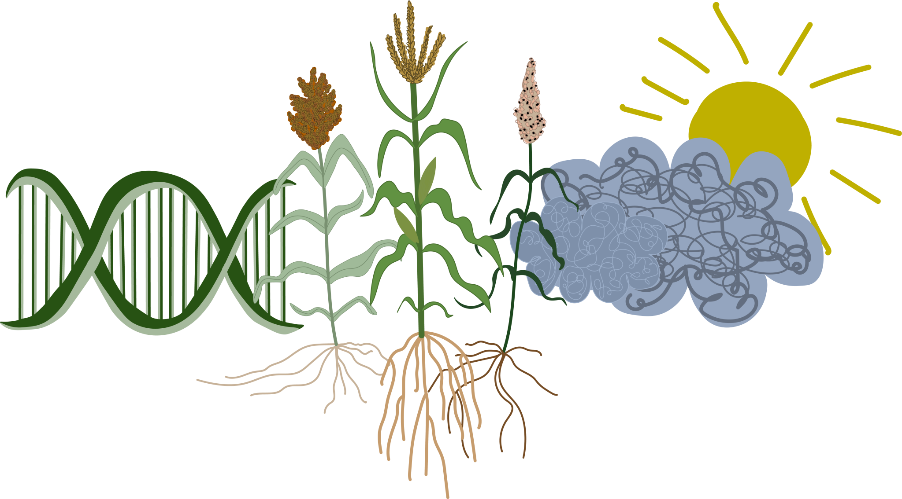

  

### Identifying the environmental gradients and loci underlying local adaptation

Genotype-environment associations (GEAs) can be useful for identifying environmentally related loci, but it is often unclear which aspect(s) of the environment might drive selection.  
I have developed a method that predicts trait variation across the multivariate environment. Fitted models are then used with environmental data to project trait values onto a larger sample of available georeferenced genotypes and used in genome-wide association (GWA).

I have used this method to model adaptive variation described by environmental gradients and identify loci associated with landrace maize…

  <h3>
    <a href="https://onlinelibrary.wiley.com/doi/10.1111/eva.13673">Root anatomy</a> |
    <a href="https://www.nature.com/articles/s41477-024-01654-7">Microbiomes</a> |
    <a href="https://www.nature.com/articles/s41588-024-01761-3">Seminal root number</a>
  </h3>

  

### Trade-offs driven by host-parasite co-evolution

Striga hermonthica is a root parasitic plant and is a major constraint to cereal crop yields in Sub-Saharan Africa.

Certain ecotypes of sorghum have adapted resistance strategies in response to local parasite prevalence.  
Using physiological and high-throughput phenotyping, I work to identify trade-offs associated with host resistance strategies.

### Modeling disruptions to adaptation

Extreme and sudden changes to climate threaten traditional local crop populations adapted to historic climates.  
However, the diversity present in crops may enhance agricultural resilience under changing conditions.

Here, we develop a framework to:
- Characterize current crop genotype-environment relationships,
- Quantify maladaptation across space and time, and
- Search for suitable varietal substitutions in the case of soot-induced climate change (e.g., nuclear winter).

We find that such catastrophic events would result in the global maladaptation of crop landraces, and a suitable varietal substitution may not exist for many locations.

Our framework can be extended to understand the impacts of greenhouse gas–induced climate change for plants adapted to historical local climates.

  <h1>
    <a href="https://www.biorxiv.org/content/10.1101/2024.05.18.594591v3">Preprint available</a>
  </h1>

